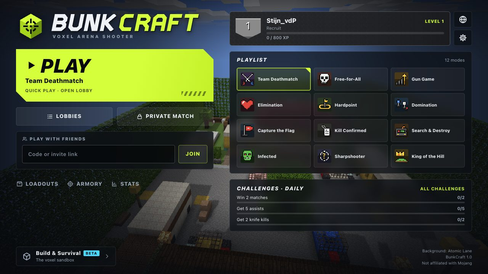
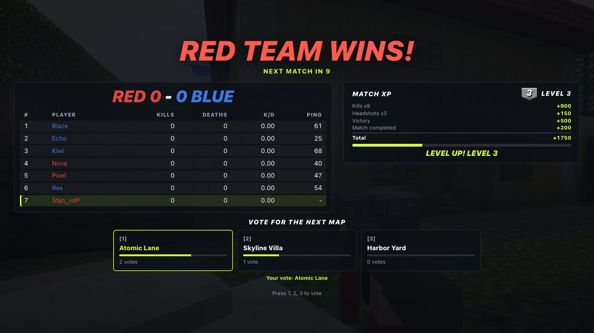
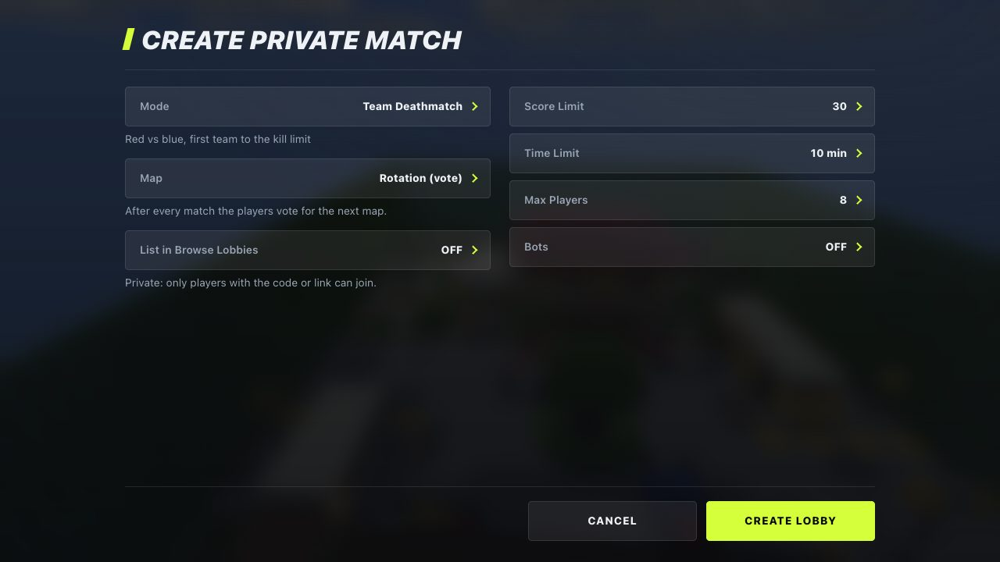
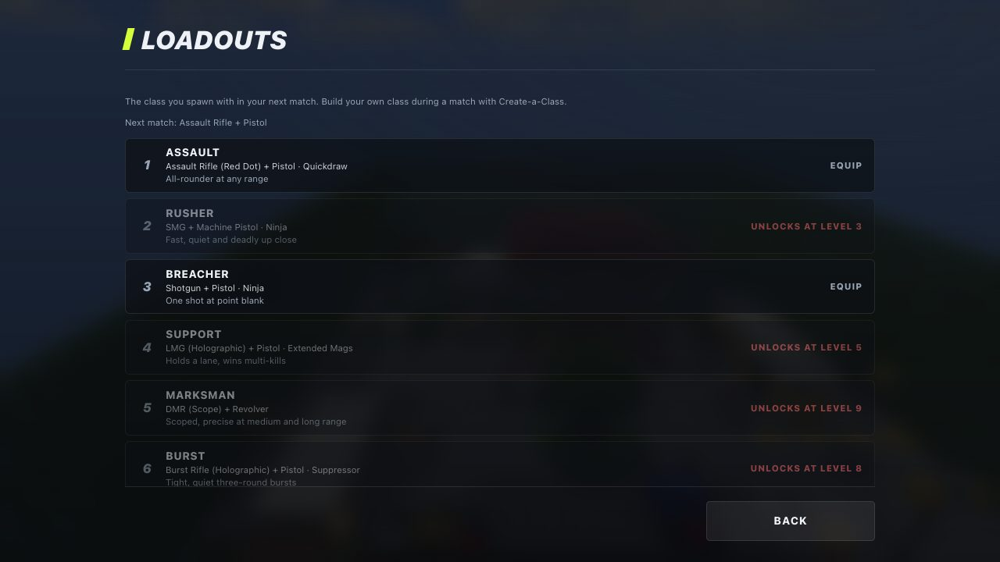
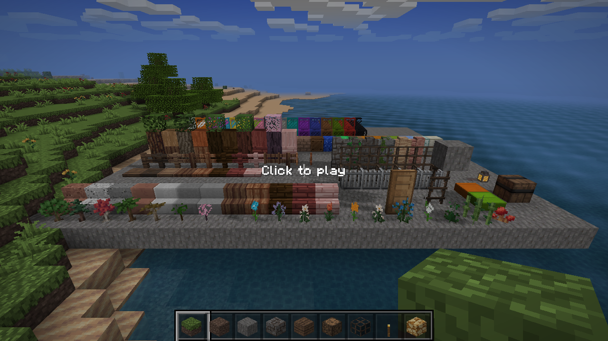
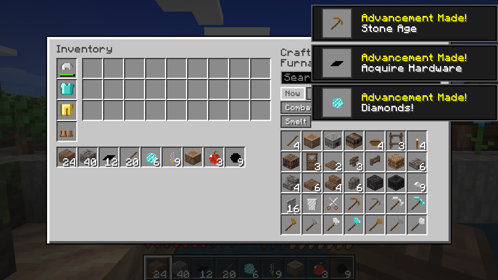
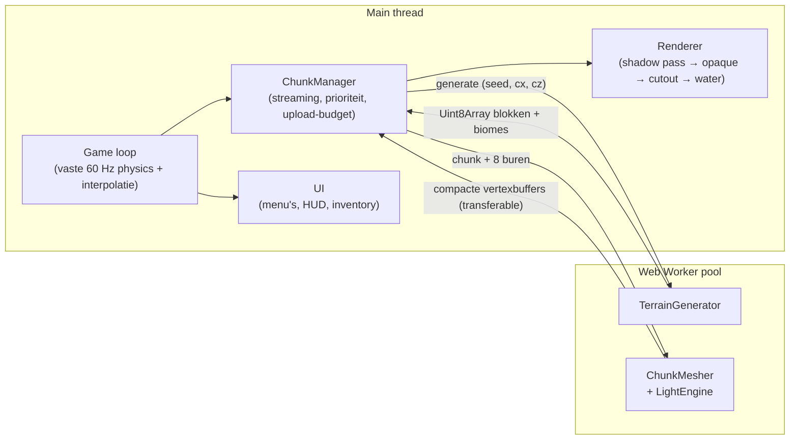

<div align="center">

# BUNKCRAFT

**Voxel-arenashooter in je browser.**

Druk op Play en je zit in een wedstrijd: 12 modi (Team Deathmatch, Search & Destroy, Hardpoint, Gun Game en meer),
17 maps, bots die lege plekken vullen, levels, uitdagingen, camo's en privéwedstrijden met vrienden via een code.
Gebouwd op een eigen voxel-engine in TypeScript met WebGL2 en Three.js. Geen installatie nodig.
De voxel-sandbox waar het mee begon zit er nog in, onder **Bouwen & Survival (bèta)**.

Live: **https://craft.bunkhosting.nl**



</div>

---

## Inhoud

- [Screenshots](#screenshots)
- [Snel starten](#snel-starten)
- [Besturing](#besturing)
- [Features](#features)
- [Multiplayer](#multiplayer)
- [Installeren, delen en hosten](#installeren-delen-en-hosten)
- [Grafische kwaliteit](#grafische-kwaliteit)
- [Originele Minecraft-textures gebruiken](#originele-minecraft-textures-gebruiken)
- [Architectuur](#architectuur)
- [Techniek in het kort](#techniek-in-het-kort)
- [Performance](#performance)
- [Projectstructuur](#projectstructuur)
- [Credits en licenties](#credits-en-licenties)

## Screenshots

| Home: Play, playlist en je profiel | Einde wedstrijd met XP en kaartstemming |
|---|---|
|  |  |

| Privéwedstrijd | Loadouts |
|---|---|
|  |  |

Alle schermen van de nieuwe look (Chromium en WebKit) staan in [`docs/screenshots/identity/`](docs/screenshots/identity/),
de keuzes erachter in [`docs/research/IDENTITY.md`](docs/research/IDENTITY.md). Hieronder de survival-sandbox.

| Overdag | 's Nachts met glowstone |
|---|---|
|  |  |

| Creative inventory | Video Settings met kwaliteitspresets |
|---|---|
|  |  |

| Nieuwe blokken (hout, kleuren, hekken, ladders, bedden) | Survival-inventory met harnas en receptenboek |
|---|---|
|  |  |


## Snel starten

Vereist: [Node.js](https://nodejs.org/) 20 of nieuwer en een browser met WebGL2
(Chrome, Edge, Firefox of Safari).

```bash
npm install
npm run dev        # start op http://localhost:5173
```

Overige scripts:

| Script | Doel |
|---|---|
| `npm run build` | Typecheck, productiebuild in `dist/` en de server als één JS-bestand in `dist-server/` |
| `npm start` | Game **en** multiplayer-server op http://localhost:3000 (na `build`) |
| `npm run load` | Laadtest met bots (`scripts/load/`, zie `docs/research/SERVER-DEPLOY.md`) |
| `npm run server` | Alleen de multiplayer-server, voor ontwikkeling (Vite stuurt `/ws` door) |
| `npm run preview` | De productiebuild lokaal serveren |
| `npm run typecheck` | Alleen TypeScript controleren |
| `npm test` | Vitest: unit-, property-, fuzz- en server-integratietests |
| `npm run test:e2e` | Playwright-flows in Chromium en WebKit |
| `npm run test:perf`, `npm run size:check` | Prestatie- en bundelbudgetten |
| `npm run build:static` | Statische build voor itch.io of een submap (`dist-static/`) |

Alle testlagen en hun valkuilen staan in [`docs/TESTING.md`](docs/TESTING.md), een actuele overdracht in
[`docs/HANDOFF.md`](docs/HANDOFF.md).

## Besturing

**Shooter**

| Toets | Actie |
|---|---|
| <kbd>W</kbd> <kbd>A</kbd> <kbd>S</kbd> <kbd>D</kbd>, <kbd>Spatie</kbd> | Lopen, springen (bunny hop) |
| <kbd>C</kbd> | Crouch; tijdens rennen een slide |
| Linkermuisknop | Schieten |
| Rechtermuisknop | Richten (ADS) |
| <kbd>R</kbd> | Herladen |
| <kbd>1</kbd> <kbd>2</kbd> <kbd>3</kbd>, <kbd>Q</kbd>, muiswiel | Primair, secundair, melee; snel wisselen |
| <kbd>Tab</kbd> (vasthouden) | Scoreboard |
| <kbd>B</kbd> | Create-a-Class |
| <kbd>T</kbd> | Chat |

Gamepad en touch werken ook, zie [`docs/CONTROLS.md`](docs/CONTROLS.md).

**Bouwen & Survival (bèta)**

| Toets | Actie |
|---|---|
| <kbd>W</kbd> <kbd>A</kbd> <kbd>S</kbd> <kbd>D</kbd> | Lopen |
| Muis | Rondkijken |
| <kbd>Spatie</kbd> | Springen / omhoog zwemmen |
| <kbd>Spatie</kbd> ×2 | Vliegen aan/uit |
| <kbd>C</kbd> | Omlaag vliegen |
| Linker <kbd>Shift</kbd> | Sprinten |
| Linkermuisknop (vasthouden) | Blok breken |
| Rechtermuisknop | Blok plaatsen |
| Middelste muisknop | Blok kiezen (pick block) |
| <kbd>1</kbd>–<kbd>9</kbd> / scrollwiel | Hotbar-slot kiezen |
| Rechtermuisknop (vasthouden) | Eten (Survival) |
| <kbd>Q</kbd> | Item laten vallen |
| <kbd>E</kbd> | Inventory / crafting |
| <kbd>T</kbd> / <kbd>/</kbd> | Chat / commando (↑/↓ geschiedenis, <kbd>Tab</kbd> vult commando's aan; in singleplayer alleen met Allow Cheats) |
| <kbd>F3</kbd> | Debug- en performance-overlay |
| <kbd>F1</kbd> | HUD verbergen |
| <kbd>F2</kbd> | Screenshot (PNG-download) |
| <kbd>F11</kbd> | Volledig scherm |
| <kbd>Esc</kbd> | Muis vrijgeven / pauzemenu |

Alle toetsen (in de shooter en de sandbox) behalve <kbd>F1</kbd>, <kbd>F2</kbd>, <kbd>F3</kbd> en <kbd>Esc</kbd> zijn aan te passen via
Options → Controls → Key Binds, ook naar muisknoppen (zoals in Minecraft).

## Features

**Shooter**
- **12 modi:** Team Deathmatch, Free For All, Gun Game, Team Elimination, Hardpoint, Domination, Capture the Flag, Kill Confirmed,
  Search & Destroy, Infected, Sharpshooter en King of the Hill, op **17 maps** met zones, vlaggen en bomsites ([`docs/GAMEMODES.md`](docs/GAMEMODES.md)).
- **Snel spelen, lobby's en privéwedstrijden** met code of link; **party's** tot 6 vrienden; **server-bots** vullen lege plekken;
  terugkeren in je match na een weggevallen verbinding; kaartstemming na elk potje.
- **Krunker-achtige beweging:** slide, slide-hop, bunny hop met momentum, air strafe, jump pads.
- **Wapens en richten:** Create-a-Class met primair, optiek, secundair en perk; red dot, holo en scopes; terugslagpatronen;
  gebalanceerd time-to-kill; geen aim assist. Alle geluid is procedureel.
- **Server-autoritair:** exacte hitregistratie met lag-compensatie, bewegings- en schotcontrole tegen valsspelen ([`docs/SECURITY.md`](docs/SECURITY.md)).
- **Voortgang:** XP, levels 1-55 met prestige, ontgrendelingen, camo's, dagelijkse en wekelijkse uitdagingen, rangen en eigen spelersskins. Zonder account:
  je profiel is een ondertekend token in je browser.
- Nederlands en Engels.

**Bouwen & Survival (bèta): wereld**
- Oneindige, seed-gebaseerde wereld met 27 biomes (generator v3), rivieren, grotten met ingangen, ravijnen, ertsaders en meer bomen en planten.
- Biome-tinting van gras en bladeren met vloeiende overgangen tussen biomes, zoals in Minecraft.

**Bouwen & Survival (bèta): gameplay**
- Vier game modes: **Survival**, **Creative**, **Hardcore** en **Spectator**.
- Survival met health, honger, adem, valschade, lava, cactus, de void, een doodscherm en respawnen.
- Mobs met goal-AI en pathfinding: dieren (fokken, temmen), zombie, creeper, skeleton, spin, enderman, slime en meer, met knockback en drops.
- Items en tools (hout, steen, ijzer, diamant), drops die je oppakt, eten en crafting via werkbank en oven.
- Advancements met toast-meldingen en een Advancements-scherm (tabs Minecraft en Adventure, zoals in Minecraft 1.21); alleen in survival, per wereld opgeslagen.
- First-person hand met swing-, equip- en eet-animaties; hurt cam.
- Fakkels (licht 14) en lava (licht 15, lavameren in diepe grotten).
- **Block states:** slabs en trappen (9 materialen, plaatsing als in Minecraft), een eikenhouten deur, en **stromend water en lava** (water 7 blokken per 5 ticks, lava 3 blokken per 30, oneindige bronnen, obsidiaan en cobblestone waar ze elkaar raken) met ijzeren, water- en lavaemmers. In multiplayer simuleert de server de vloeistoffen. Zie [`docs/BLOCKSTATES.md`](docs/BLOCKSTATES.md).
- First-person-besturing met pointer lock, zwaartekracht, springen, sprinten, zwemmen en vliegen.
- Blokken breken met crack-animatie en deeltjes; blokken plaatsen met een bereik van 5 blokken.
- **Veel inhoud uit Minecraft 1.21** (zie [`docs/CONTENT.md`](docs/CONTENT.md)): 8 houtsoorten met stripped logs, slabs, trappen, deuren, luiken, hekken en poorten, steenvarianten (graniet, diorite, andesiet, tuff, calciet, deepslate, bakstenen), zandsteen en rood zandsteen, 16 kleuren wol, beton, terracotta, geglazuurd terracotta, gekleurd glas en ruiten, tapijt en bedden, muren, ijzeren tralies, ladders, lantaarns, kisten met 27 slots, ertsen (koper, lapis, redstone, smaragd) en metaalblokken, bloemen en saplings.
- **Tools en harnas:** houweel, bijl, schop, schoffel en zwaard in vijf tiers met de echte schade en duurzaamheid, een schaar, harnas van leer tot diamant (armor-balk, schadeformule met toughness, slijtage), schoffel maakt akkergrond, schop paden, bijl stript logs.
- **Voedsel en grondstoffen** met de echte honger- en saturatiewaarden, ongeveer 420 recepten met vanilla-aantallen en een receptenboek met categorieën en zoeken.
- 180 bloktypes en ruim 480 items; een creative inventory met tabs (Building Blocks, Colored Blocks, Natural Blocks, Functional Blocks, Redstone, Tools, Combat, Food, Ingredients), scrollen en zoeken, en een hotbar.
- Werelden en je bouwwerken worden automatisch opgeslagen (IndexedDB).

**Graphics (sandbox en arena)**
- Per-vertex ambient occlusion en smooth lighting met sky light en block light (glowstone verlicht zijn omgeving).
- Zonschaduwen, distance fog, een luchtkoepel met vierkante zon en maan, sterren en een dag/nachtcyclus.
- Blokwolken, geanimeerd water met reflecties en golfjes, onderwatereffect, view bobbing en sprint-FOV.

**Menu's**
- De home is de voordeur van de shooter, in de huisstijl van [Bunkhosting](https://bunkhosting.nl) (Manrope en Inter; zie [`docs/research/IDENTITY.md`](docs/research/IDENTITY.md)), met een live vlucht over een arenamap op de achtergrond.
- De survival-menu's achter Bouwen & Survival zijn nog opgebouwd zoals Minecraft 1.21: wereldselectie met screenshots, pauzemenu met Statistics en een F3-scherm. Zie [`docs/UI.md`](docs/UI.md).
- In het Engels en Nederlands (Options → Language), met toetsenbordnavigatie (pijltjes, Tab, Enter, Esc).
- In de inventory: <kbd>1</kbd>–<kbd>9</kbd> boven een slot wisselt met de hotbar, <kbd>Q</kbd> gooit een item weg, dubbelklik verzamelt.
- Procedurele geluidseffecten en generatieve achtergrondmuziek.

## Multiplayer

BunkCraft draait als één Node.js-server die de game én de multiplayer-WebSocket op dezelfde poort
aanbiedt. In de shooter maakt **Privéwedstrijd** een code en een link; vrienden openen de link of plakken de code
bij **Speel met vrienden** op de home. Voor de sandbox: **Bouwen & Survival → Multiplayer → Create Game**.

```bash
npm run build
npm start                     # http://localhost:3000 → Play, of Bouwen & Survival → Multiplayer
# Op je eigen Linux-server met automatische HTTPS (Docker + Caddy), zie docs/SERVER.md:
sudo ./scripts/install.sh --domain play.example.com
```

- **Shooter:** de server bepaalt alles (matchregels, schade, respawns, XP) en controleert beweging en schoten; bots, party's,
  rejoin en skins staan in [`docs/GAMEMODES.md`](docs/GAMEMODES.md) en [`docs/SERVER.md`](docs/SERVER.md).
- **Sandbox:** iedereen bouwt mee in dezelfde wereld; alleen blokwijzigingen gaan over het netwerk, want het terrein komt uit de seed.
  Mobs, drops, kisten, ovens en vloeistoffen draaien op de server; chat met commando's, ops en wachtwoorden.
- **Configuratie:** via omgevingsvariabelen (`PORT`, `DATA_DIR`, `SEED`, `GAMEMODE`, `WORLD_NAME`, `MAX_PLAYERS`, …), zie [`docs/SERVER.md`](docs/SERVER.md).
- **Hosten:** `install.sh` zet Docker + Caddy met automatische HTTPS neer, of met `--proxy none` alleen de game-server achter een
  Cloudflare Tunnel (zo draait de live server). Images komen kant-en-klaar van GHCR en updaten zichzelf. `GET /health` toont de versie (`1.1.<build>+<commit>`).

Volgende stappen: [`docs/ROADMAP.md`](docs/ROADMAP.md).

## Installeren, delen en hosten

**App (PWA).** Chrome, Edge en Android bieden "Install App" aan (knop op het titelscherm en in Options); op iOS
kies je Deel → Zet op beginscherm. De service worker (`public/sw.js`, geen Workbox) cachet de hele game, dus
singleplayer werkt offline, inclusief je werelden (IndexedDB). Een nieuwe versie meldt zich met een "Reload"-toast.
`/api`, `/ws` en `/health` worden nooit gecachet.

**Werelden delen en bewaren.** In Select World: *Export* geeft een `.bunkworld` (zip met `level.json`,
`player.json`, `advancements.json`, `icon.png` en de bewerkte chunks), *Import* leest er een of een backup terug
(ongeldige of te grote zips worden geweigerd, botsende id's krijgen een nieuw id), *Backup All* downloadt alle
werelden in één zip. *Edit* hernoemt en wisselt de spelmodus, *Re-Create* opent Create World met dezelfde seed.
Een link als `https://jouw.site/?seed=bunker&mode=survival` opent Create World ingevuld. <kbd>F2</kbd> bewaart een
screenshot (alleen het 3D-beeld, zonder HUD), "Copy Seed" staat in het pauzemenu.

**Zonder server hosten (itch.io, GitHub Pages, Netlify).** `npm run build:static` bouwt `dist-static/` met relatieve
paden en maakt `bunkcraft-static.zip` (`index.html` in de root). Upload de zip op itch.io als "HTML" met
"This file will be played in the browser" aan; of zet de map op elke statische host, ook onder een submap
(`/game/`). Multiplayer vraagt dan om het adres van een server. Zie `docs/DISTRIBUTION.md`.

## Grafische kwaliteit

Kies een preset onder **Options → Video Settings**. Daarna kun je elke instelling nog zelf aanpassen.

| Preset | Voor | Render distance | Render scale | Schaduwen |
|---|---|---|---|---|
| Low | Oudere laptops, ingebouwde graphics | 4 chunks | 75 % | Uit |
| **Medium** (standaard) | De meeste laptops | 8 | 100 % | Low |
| High | Gaming-laptops en desktops | 12 | 100 % | High |
| Ultra | Losse videokaart | 16 | 100 % | High |
| Extreme | High-end GPU | 20 | 150 % (supersampling) | Ultra (4096²) |

Daarnaast zijn er instellingen voor Brightness (Moody → Bright), Clouds, Particles, GUI Scale, FOV en View Bobbing.

## Originele Minecraft-textures gebruiken

In Bouwen & Survival gebruikt BunkCraft standaard het gratis texture pack **Pixel Perfection**. Je kunt ook je **eigen**
Minecraft-installatie laden:

1. Ga naar **Options → Resource Packs → Open Pack File...**
2. Kies `%APPDATA%\.minecraft\versions\<versie>\<versie>.jar` (Minecraft Java 1.13 of nieuwer) of een resource pack (`.zip`).

BunkCraft pakt alleen de bloktextures uit en bewaart die **alleen in je eigen browser**. Ze worden
nooit geüpload of met de game meegeleverd, zodat er geen auteursrechtelijk beschermde Mojang-assets
in deze repository staan.

## Architectuur



1. De **ChunkManager** vraagt chunks aan in spiraalvolgorde rond de speler, de dichtstbijzijnde eerst.
2. De **worker** genereert het terrein: 16×16×128 blokken in een `Uint8Array`.
3. Zodra een chunk en zijn 8 buren bestaan, berekent een worker het **licht** (BFS over een regio van 48×48) en de **mesh**: alleen zichtbare vlakken, samengevoegd met greedy meshing.
4. De main thread uploadt meshes binnen een byte-budget per frame, zodat het spel niet hapert.
5. Bewerkingen door de speler worden met voorrang opnieuw gemesht, zodat ze direct zichtbaar zijn.

## Techniek in het kort

| Onderwerp | Aanpak |
|---|---|
| Opslag van blokken | `Uint8Array` per chunk (32 KB), geen objecten per blok |
| Meshing | Greedy meshing: alleen zichtbare vlakken, vlakken met dezelfde textuur en belichting worden samengevoegd |
| Vertexformaat | 16 bytes, alle attributen 4-componentig (vermijdt CPU-conversie in ANGLE/D3D11) |
| Textures | WebGL2-texture array in plaats van een atlas: geen bleeding, nette mipmaps, herhalende UV's |
| Belichting | Sky light en block light (0–15) per blok, smooth lighting en AO per vertex, Minecraft-lichtcurve |
| Render passes | Opaque zonder `discard` (early-Z blijft actief), aparte cutout-pass voor bladeren en glas, water geblend |
| Schaduwen | Directionele shadow map met texel snapping, gecachet: alleen opnieuw bij zon- of wereldveranderingen |
| Culling | Face culling in de mesher, frustum culling per chunk, chunks buiten de render distance worden opgeruimd |
| Opslaan | IndexedDB, alleen gewijzigde blokken per chunk (sparse) |

Achtergrond, metingen en de afweging Three.js/WebGL2 tegenover WebGPU, Babylon, Godot en Unity staan in
[`docs/RESEARCH.md`](docs/RESEARCH.md). Game modes, mobs, items en de roadmap staan in [`docs/GAMEPLAY.md`](docs/GAMEPLAY.md),
het multiplayer-plan in [`docs/MULTIPLAYER.md`](docs/MULTIPLAYER.md). De oorspronkelijke opdracht staat in [`plan`](plan).

## Performance

Sandbox, gemeten op een **geïntegreerde AMD Radeon (Ryzen APU)** in Chrome, op 1280×720:

| Preset | FPS |
|---|---|
| Low | 130–140 |
| Medium | 144 (limiet van het scherm) |
| High | 110–113 |
| Ultra | 66–70 |
| Extreme | ~43 (bedoeld voor een losse videokaart) |

Een arenamatch met 16 spelers haalt op een MacBook M1 Pro 120 FPS (vsync) met een frametijd p99 van ~10 ms; de server gebruikt
daarvoor minder dan 1% van een core. Druk op <kbd>F3</kbd> voor live FPS, frametijd, draw calls, driehoeken, chunks en workerstatistieken.

## Projectstructuur

```
src/
├── core/        Game loop, renderer, input, camera, audio (procedureel), settings
├── world/       Blokregistry, chunks, ChunkManager, terreingenerator, biomes, raycast
├── entities/    Mobs (AI, modellen, rendering), item-drops, EntityManager
├── items/       Items, tools, inventory, recepten
├── rendering/   Mesher, lighting, shaders, textures, texture packs, lucht, wolken, deeltjes, schaduwen, skin-atlas
├── player/      Speler, physics, collision, game modes, health/honger
├── modes/       Shooter: wapens, balans, hitscan, loadouts, maps (maps/), voortgangsregels (progression/), party-regels
├── ui/          Home, Realms-menu, arena-HUD, party-paneel, menu's, inventory, F3, merkstijl (Brand.ts, shell.css), i18n NL/EN
├── skins/       Skinformaat (gedeeld door client en server)
├── workers/     Worker pool en chunk worker
├── net/         Protocol, NetClient, binaire frames, rejoin, party-, profiel- en skin-API's
└── save/        IndexedDB-opslag
server/          Node-server: statische bestanden, WebSocket-gameserver, matches (modes/), bots/, anticheat/,
                 progression/ (profielen en XP), skins/, Parties.ts, chunkgen/ (workerthreads)
scripts/         install.sh en update.sh/autoupdate.sh (deploy), benchmarks, QA-scripts (qa/), laadtest (load/)
deploy/          systemd-unit voor een installatie zonder Docker
tests/           Vitest (unit, integration/) en Playwright (e2e/)
public/
├── fonts/                        Pixel-font, Manrope en Inter (OFL)
└── texturepacks/pixel-perfection Standaard texture pack (CC BY-SA 4.0)
docs/            HANDOFF, ROADMAP, GAMEMODES, SERVER, SECURITY, TESTING, UI, CONTROLS, GAMEPLAY, research/, qa/, screenshots/
```

## Credits en licenties

- **Textures:** [Pixel Perfection](https://github.com/minetest-texture-packs/Pixel-Perfection) van Hugh "XSSheep" Rutland en bijdragers (Toby109tt, tacotexmex, devurandom), licentie [CC BY-SA 4.0](https://creativecommons.org/licenses/by-sa/4.0/). Gras- en bladtextures worden tijdens het laden grijs gemaakt voor biome-tinting. Zie `public/texturepacks/pixel-perfection/`.
- **Fonts:** [Manrope](https://github.com/sharanda/manrope) en [Inter](https://rsms.me/inter/) voor de menu's (SIL OFL 1.1, `public/fonts/LICENSE-OFL-inter-manrope.txt`). Pixelfont voor de HUD: [Minecraft-Font](https://github.com/IdreesInc/Minecraft-Font) van Idrees Hassan, licentie SIL Open Font License 1.1 (`public/fonts/LICENSE-OFL.txt`). Het is met de hand nagetekend en bevat geen Mojang-bestanden.
- **Rendering:** [three.js](https://threejs.org/) (MIT). Zip-import via [fflate](https://github.com/101arrowz/fflate) (MIT). Server: [ws](https://github.com/websockets/ws) (MIT).
- **Zelf gemaakt:** het terrein, de procedurele textures, het logo, de geluiden en de muziek worden in code gegenereerd.

BunkCraft is niet verbonden aan Mojang of Microsoft en bevat geen Minecraft-assets.
