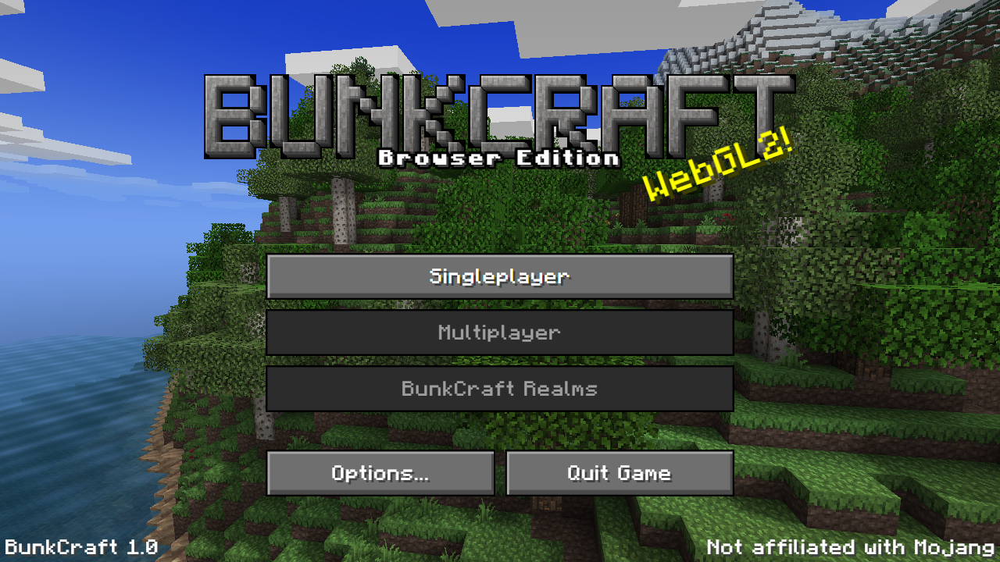
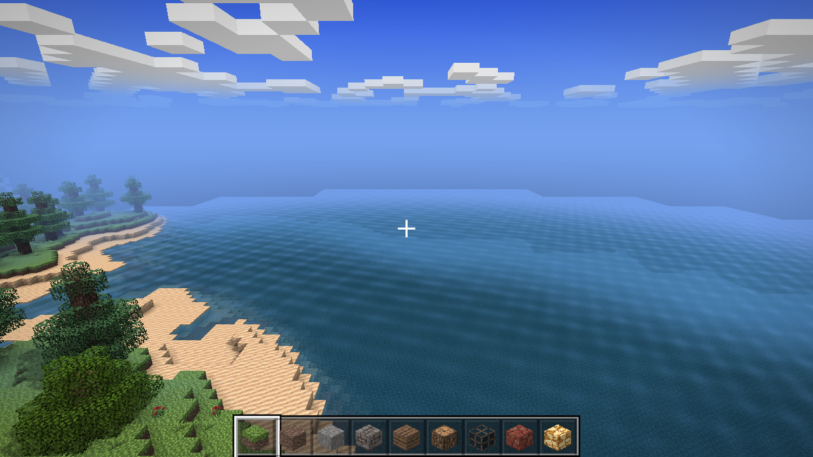
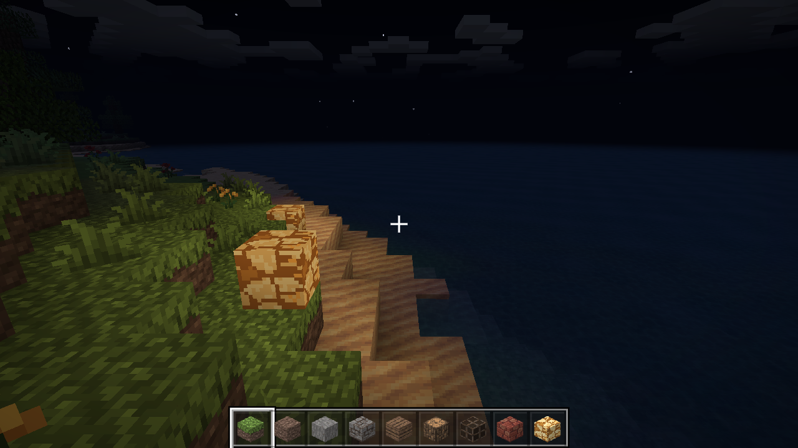
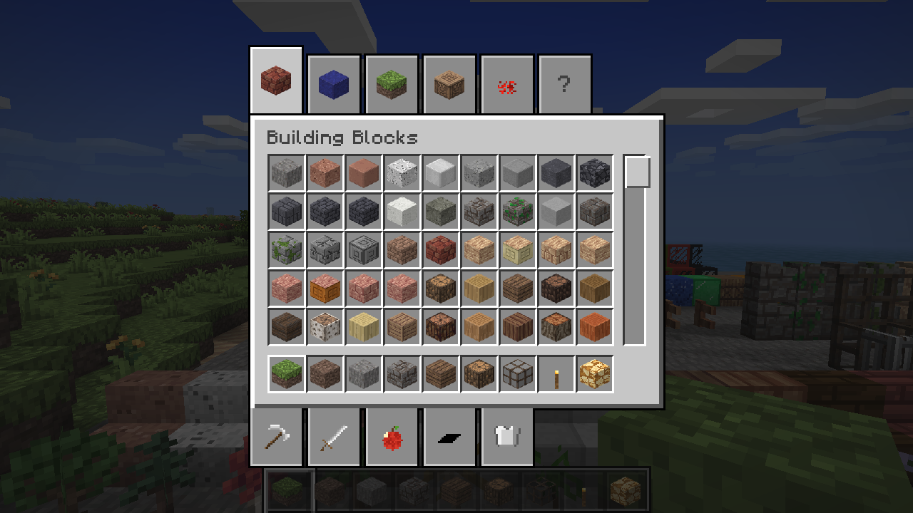
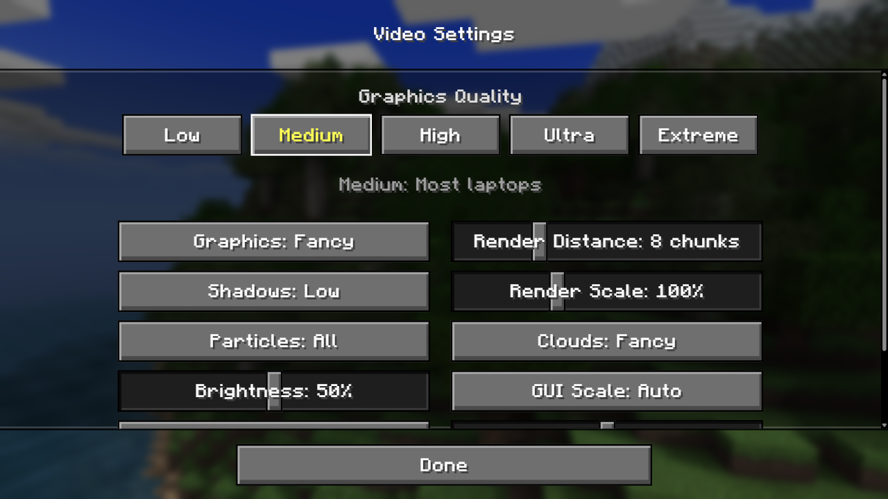
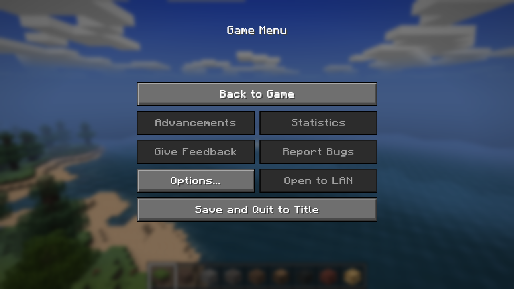
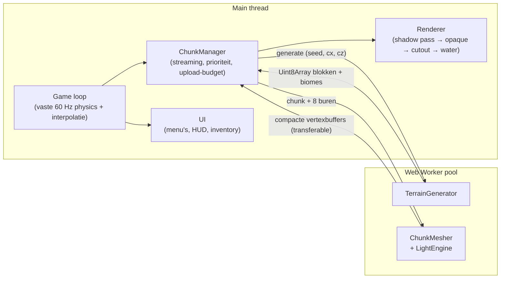

<div align="center">

# BUNKCRAFT

**Een Minecraft-geïnspireerde voxel-game die volledig in de browser draait.**

Een echte, kleine voxel-engine in TypeScript met WebGL2 en Three.js: procedurele werelden,
chunk-streaming via Web Workers, greedy meshing, smooth lighting, schaduwen en een
dag/nachtcyclus. Geen installatie nodig, en geen Minecraft-assets.



</div>

---

## Inhoud

- [Screenshots](#screenshots)
- [Snel starten](#snel-starten)
- [Besturing](#besturing)
- [Features](#features)
- [Grafische kwaliteit](#grafische-kwaliteit)
- [Originele Minecraft-textures gebruiken](#originele-minecraft-textures-gebruiken)
- [Architectuur](#architectuur)
- [Techniek in het kort](#techniek-in-het-kort)
- [Performance](#performance)
- [Projectstructuur](#projectstructuur)
- [Credits en licenties](#credits-en-licenties)

## Screenshots

| Overdag | 's Nachts met glowstone |
|---|---|
|  |  |

| Creative inventory | Video Settings met kwaliteitspresets |
|---|---|
|  |  |



## Snel starten

Vereist: [Node.js](https://nodejs.org/) 20 of nieuwer en een browser met WebGL2
(Chrome, Edge, Firefox of Safari).

```bash
npm install
npm run dev        # start op http://localhost:5173
```

Overige scripts:

| Script | Doel |
|---|---|
| `npm run build` | Typecheck en productiebuild in `dist/` |
| `npm start` | Game **en** multiplayer-server op http://localhost:3000 (na `build`) |
| `npm run server` | Alleen de multiplayer-server, voor ontwikkeling (Vite stuurt `/ws` door) |
| `npm run preview` | De productiebuild lokaal serveren |
| `npm run typecheck` | Alleen TypeScript controleren |

## Besturing

| Toets | Actie |
|---|---|
| <kbd>W</kbd> <kbd>A</kbd> <kbd>S</kbd> <kbd>D</kbd> | Lopen |
| Muis | Rondkijken |
| <kbd>Spatie</kbd> | Springen / omhoog zwemmen |
| <kbd>Spatie</kbd> ×2 | Vliegen aan/uit |
| <kbd>C</kbd> | Omlaag vliegen |
| Linker <kbd>Shift</kbd> | Sprinten |
| Linkermuisknop (vasthouden) | Blok breken |
| Rechtermuisknop | Blok plaatsen |
| Middelste muisknop | Blok kiezen (pick block) |
| <kbd>1</kbd>–<kbd>9</kbd> / scrollwiel | Hotbar-slot kiezen |
| Rechtermuisknop (vasthouden) | Eten (Survival) |
| <kbd>Q</kbd> | Item laten vallen |
| <kbd>E</kbd> | Inventory / crafting |
| <kbd>T</kbd> / <kbd>/</kbd> | Chat / commando (multiplayer) |
| <kbd>F3</kbd> | Debug- en performance-overlay |
| <kbd>F1</kbd> | HUD verbergen |
| <kbd>Esc</kbd> | Muis vrijgeven / pauzemenu |

Alle toetsen behalve <kbd>F1</kbd>, <kbd>F3</kbd> en <kbd>Esc</kbd> zijn aan te passen via
Options → Controls → Key Binds, ook naar muisknoppen (zoals in Minecraft).

## Features

**Wereld**
- Oneindige, seed-gebaseerde wereld met 8 biomes: oceaan, strand, vlakte, bos, woestijn, taiga, sneeuwvlakte en bergen.
- Grotten (spaghetti-tunnels en grote grotten), ertsaders, eiken, berken, sparren, cactussen, bloemen en hoog gras.
- Biome-tinting van gras en bladeren met vloeiende overgangen tussen biomes, zoals in Minecraft.

**Gameplay**
- Vier game modes: **Survival**, **Creative**, **Hardcore** en **Spectator**.
- Survival met health, honger, adem, valschade, lava, cactus, de void, een doodscherm en respawnen.
- Mobs: varken, koe, schaap, kip, zombie en creeper (met explosies), met Minecraft-loopanimaties, AI, spawnen in het donker en gevechten met knockback.
- Items en tools (hout, steen, ijzer, diamant), drops die je oppakt, eten en crafting via werkbank en oven.
- First-person hand met swing-, equip- en eet-animaties; hurt cam.
- Fakkels (licht 14) en lava (licht 15, lavameren in diepe grotten).
- First-person-besturing met pointer lock, zwaartekracht, springen, sprinten, zwemmen en vliegen.
- Blokken breken met crack-animatie en deeltjes; blokken plaatsen met een bereik van 5 blokken.
- 42 bloktypes, een creative inventory met tabbladen en een hotbar.
- Werelden en je bouwwerken worden automatisch opgeslagen (IndexedDB).

**Graphics**
- Per-vertex ambient occlusion en smooth lighting met sky light en block light (glowstone verlicht zijn omgeving).
- Zonschaduwen, distance fog, een luchtkoepel met vierkante zon en maan, sterren en een dag/nachtcyclus.
- Blokwolken, geanimeerd water met reflecties en golfjes, onderwatereffect, view bobbing en sprint-FOV.

**Menu's**
- Opgebouwd zoals Minecraft 1.21: titelscherm met panorama, wereldselectie met screenshots, Options-hub met submenu's, pauzemenu en een F3-scherm.
- Procedurele geluidseffecten en generatieve achtergrondmuziek.

## Multiplayer

BunkCraft draait als één Node.js-server die de game én de multiplayer-WebSocket op dezelfde poort
aanbiedt. **Multiplayer → Create Game** geeft je een code en een link om te delen; vrienden openen de
link of typen de code onder **Join Game**.

```bash
npm run build
npm start                     # http://localhost:3000 → Multiplayer → Create Game
# Op je eigen domein met automatische HTTPS (Caddy):
DOMAIN=play.example.com docker compose up -d
```

- **Gedeelde wereld:** iedereen bouwt mee in dezelfde wereld. Alleen blokwijzigingen gaan over het netwerk, want het terrein komt uit de seed.
- **Spelers en chat:** je ziet andere spelers met naamkaartje en loopanimatie, er is chat met commando's (`/help`, `/time set`, `/spawn`), en de dag/nachtcyclus is gedeeld.
- **Validatie op de server:** de server controleert bereik, blok-id's, snelheid en rate limits, en bewaart positie, inventory en health per speler.
- **Configuratie:** via omgevingsvariabelen (`SEED`, `GAMEMODE`, `WORLD_NAME`, …). Zie [`docs/SERVER.md`](docs/SERVER.md) voor HTTPS via nginx of Caddy.

Multiplayer v1 is vredig (geen mobs). Zie [`docs/ROADMAP.md`](docs/ROADMAP.md) voor de volgende stappen.

## Grafische kwaliteit

Kies een preset onder **Options → Video Settings**. Daarna kun je elke instelling nog zelf aanpassen.

| Preset | Voor | Render distance | Render scale | Schaduwen |
|---|---|---|---|---|
| Low | Oudere laptops, ingebouwde graphics | 4 chunks | 75 % | Uit |
| **Medium** (standaard) | De meeste laptops | 8 | 100 % | Low |
| High | Gaming-laptops en desktops | 12 | 100 % | High |
| Ultra | Losse videokaart | 16 | 100 % | High |
| Extreme | High-end GPU | 20 | 150 % (supersampling) | Ultra (4096²) |

Daarnaast zijn er instellingen voor Brightness (Moody → Bright), Clouds, Particles, GUI Scale, FOV en View Bobbing.

## Originele Minecraft-textures gebruiken

Standaard gebruikt BunkCraft het gratis texture pack **Pixel Perfection**. Je kunt ook je **eigen**
Minecraft-installatie laden:

1. Ga naar **Options → Resource Packs → Open Pack File...**
2. Kies `%APPDATA%\.minecraft\versions\<versie>\<versie>.jar` (Minecraft Java 1.13 of nieuwer) of een resource pack (`.zip`).

BunkCraft pakt alleen de bloktextures uit en bewaart die **alleen in je eigen browser**. Ze worden
nooit geüpload of met de game meegeleverd, zodat er geen auteursrechtelijk beschermde Mojang-assets
in deze repository staan.

## Architectuur



1. De **ChunkManager** vraagt chunks aan in spiraalvolgorde rond de speler, de dichtstbijzijnde eerst.
2. De **worker** genereert het terrein: 16×16×128 blokken in een `Uint8Array`.
3. Zodra een chunk en zijn 8 buren bestaan, berekent een worker het **licht** (BFS over een regio van 48×48) en de **mesh**: alleen zichtbare vlakken, samengevoegd met greedy meshing.
4. De main thread uploadt meshes binnen een byte-budget per frame, zodat het spel niet hapert.
5. Bewerkingen door de speler worden met voorrang opnieuw gemesht, zodat ze direct zichtbaar zijn.

## Techniek in het kort

| Onderwerp | Aanpak |
|---|---|
| Opslag van blokken | `Uint8Array` per chunk (32 KB), geen objecten per blok |
| Meshing | Greedy meshing: alleen zichtbare vlakken, vlakken met dezelfde textuur en belichting worden samengevoegd |
| Vertexformaat | 16 bytes, alle attributen 4-componentig (vermijdt CPU-conversie in ANGLE/D3D11) |
| Textures | WebGL2-texture array in plaats van een atlas: geen bleeding, nette mipmaps, herhalende UV's |
| Belichting | Sky light en block light (0–15) per blok, smooth lighting en AO per vertex, Minecraft-lichtcurve |
| Render passes | Opaque zonder `discard` (early-Z blijft actief), aparte cutout-pass voor bladeren en glas, water geblend |
| Schaduwen | Directionele shadow map met texel snapping, gecachet: alleen opnieuw bij zon- of wereldveranderingen |
| Culling | Face culling in de mesher, frustum culling per chunk, chunks buiten de render distance worden opgeruimd |
| Opslaan | IndexedDB, alleen gewijzigde blokken per chunk (sparse) |

Achtergrond, metingen en de afweging Three.js/WebGL2 tegenover WebGPU, Babylon, Godot en Unity staan in
[`docs/RESEARCH.md`](docs/RESEARCH.md). Game modes, mobs, items en de roadmap staan in [`docs/GAMEPLAY.md`](docs/GAMEPLAY.md),
het multiplayer-plan in [`docs/MULTIPLAYER.md`](docs/MULTIPLAYER.md). De oorspronkelijke opdracht staat in [`plan`](plan).

## Performance

Gemeten op een **geïntegreerde AMD Radeon (Ryzen APU)** in Chrome, op 1280×720:

| Preset | FPS |
|---|---|
| Low | 130–140 |
| Medium | 144 (limiet van het scherm) |
| High | 110–113 |
| Ultra | 66–70 |
| Extreme | ~43 (bedoeld voor een losse videokaart) |

Druk op <kbd>F3</kbd> voor live FPS, frametijd, draw calls, driehoeken, chunks en workerstatistieken.

## Projectstructuur

```
src/
├── core/        Game loop, renderer, input, camera, audio, settings
├── world/       Blokregistry, chunks, ChunkManager, terreingenerator, biomes, raycast
├── entities/    Mobs (AI, modellen, rendering), item-drops, EntityManager
├── items/       Items, tools, inventory, recepten
├── rendering/   Mesher, lighting, shaders, textures, texture packs, lucht, wolken, deeltjes, schaduwen
├── player/      Speler, physics, collision, game modes, health/honger
├── ui/          Titelscherm, menu's, HUD, hotbar, inventory, F3, logo, GUI-schaal
├── workers/     Worker pool en chunk worker
├── net/         Multiplayer-protocol, NetClient, andere spelers
└── save/        IndexedDB-opslag
server/          Node-server: statische bestanden + WebSocket-gameserver
public/
├── fonts/                        Pixel-font (OFL)
└── texturepacks/pixel-perfection Standaard texture pack (CC BY-SA 4.0)
docs/
├── RESEARCH.md                   Onderzoek: Minecraft-look, performance, technologiekeuze
└── screenshots/
```

## Credits en licenties

- **Textures:** [Pixel Perfection](https://github.com/minetest-texture-packs/Pixel-Perfection) van Hugh "XSSheep" Rutland en bijdragers (Toby109tt, tacotexmex, devurandom), licentie [CC BY-SA 4.0](https://creativecommons.org/licenses/by-sa/4.0/). Gras- en bladtextures worden tijdens het laden grijs gemaakt voor biome-tinting. Zie `public/texturepacks/pixel-perfection/`.
- **Font:** [Minecraft-Font](https://github.com/IdreesInc/Minecraft-Font) van Idrees Hassan, licentie SIL Open Font License 1.1 (`public/fonts/LICENSE-OFL.txt`). Het is met de hand nagetekend en bevat geen Mojang-bestanden.
- **Rendering:** [three.js](https://threejs.org/) (MIT). Zip-import via [fflate](https://github.com/101arrowz/fflate) (MIT). Server: [ws](https://github.com/websockets/ws) (MIT).
- **Zelf gemaakt:** het terrein, de procedurele textures, het logo, de geluiden en de muziek worden in code gegenereerd.

BunkCraft is niet verbonden aan Mojang of Microsoft en bevat geen Minecraft-assets.
