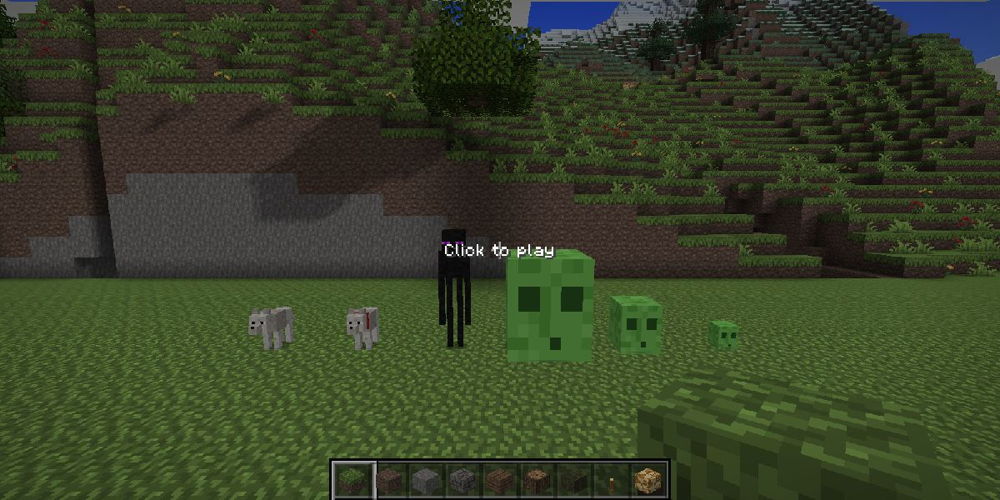
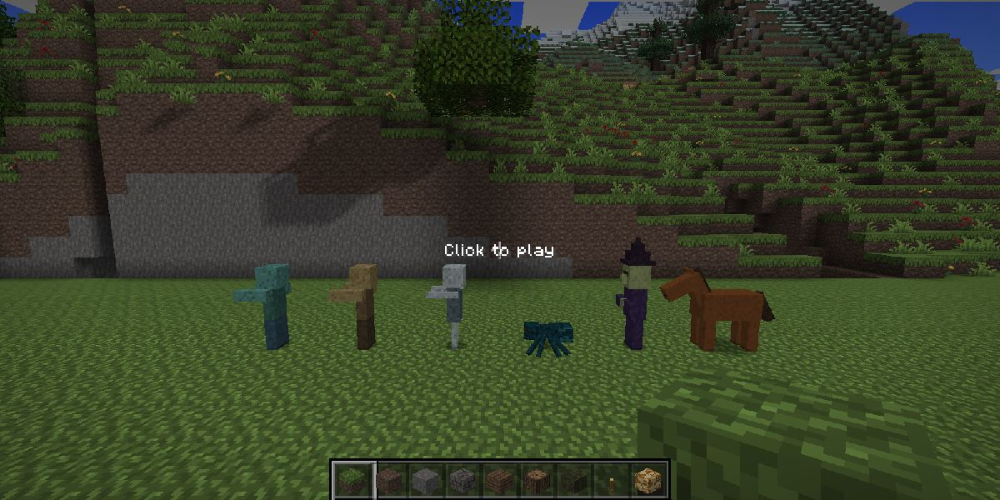
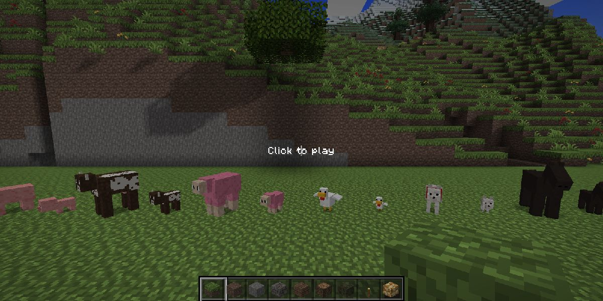
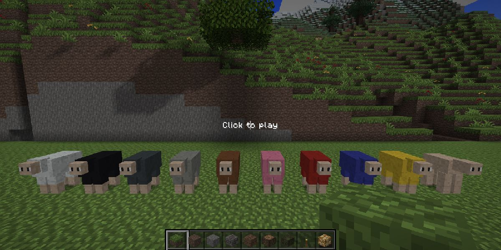
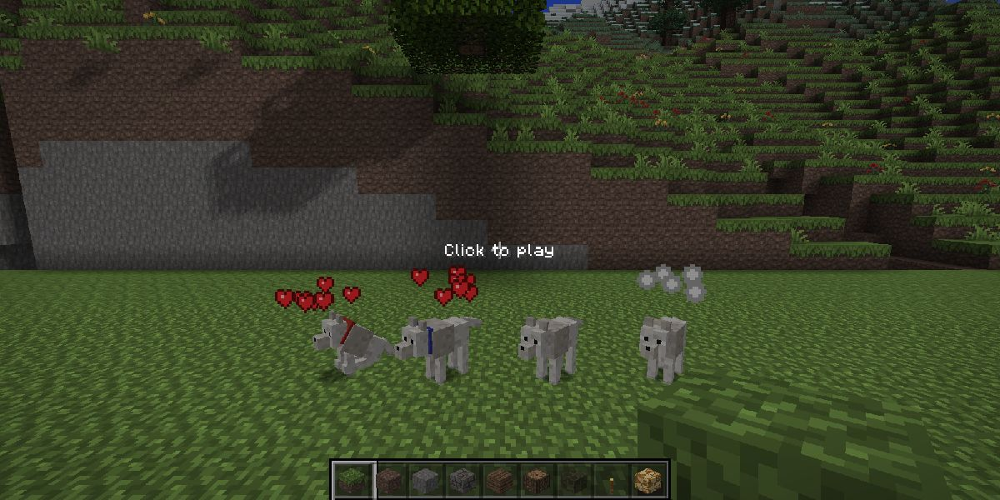

# BunkCraft gameplay: onderzoek en implementatie

Samenvatting van het gameplay-onderzoek (game modes, mobs, animaties, blokken, items) en wat daarvan
in BunkCraft zit. Getallen komen uit de Minecraft Wiki, tenzij anders vermeld.

## Game modes

| Mode | Regels in BunkCraft |
|---|---|
| **Survival** | Health 20, honger 20 (saturatie 5), adem 300 ticks. Blokken breken kost tijd, en drops pak je op. Niet vliegen. |
| **Creative** | Onkwetsbaar (behalve in de void), vliegen met dubbel spatie, direct breken, oneindig blokken, creative inventory. |
| **Hardcore** | Survival met één leven: na de dood volgt "Game over!" en kun je alleen nog toekijken (Spectate World). |
| **Spectator** | Vliegen door blokken (noclip), geen interactie, geen hotbar. |

### Schade en herstel (vanilla-waarden)

| Bron | Schade |
|---|---|
| Vallen | `ceil(valafstand − 3)` |
| Verdrinken | 2 per seconde, na 300 ticks zonder lucht |
| Lava | 4 per 0,5 s, daarna 15 s branden (1 per seconde; water blust) |
| Cactus | 1 bij contact |
| Void | 4 per 0,5 s onder y = −64 (ook in Creative) |
| Stikken | 1 per 0,5 s met je hoofd in een vast blok |
| Verhongeren | 1 per 4 s bij honger 0 (Easy tot 10 HP, Normal tot ½ hartje, Hard en Hardcore dodelijk) |

- **Onkwetsbaarheid:** 10 ticks na een treffer. Een zwaardere klap telt alleen voor het verschil.
- **Uitputting:** sprinten 0,1/m, springen 0,05 (sprint-sprong 0,2), blok breken 0,005, zwemmen 0,01/m, schade 0,1. Elke 4 punten uitputting kost eerst saturatie, daarna honger.
- **Regeneratie:** 1 HP per 80 ticks bij honger ≥ 18, of per 10 ticks bij volle honger met saturatie.
- **Sprinten:** niet mogelijk bij honger ≤ 6.

## Schade, moeilijkheid en game rules (Foundation 3)

**Eén schade-pijplijn** (`src/player/Damage.ts`, DOM-vrij, gedeeld door client, server en tests). Alle schade aan speler
én mobs gaat door `dealDamage` met een getypte `DamageSource` (`mob`, `player`, `arrow`, `explosion`, `fall`, `fire`,
`lava`, `drown`, `cactus`, `void`, `suffocate`, `starve`, `poison`, `wither`, `magic`, `lightning`, `anvil`, `generic`),
in de volgorde van Minecraft:

1. game rules (`fallDamage`, `fireDamage`, `drowningDamage`) en Fire Resistance;
2. moeilijkheid (alleen mob-schade aan de speler): Peaceful ×0, Easy `min(D/2+1, D)`, Normal ×1, Hard ×1,5;
3. onkwetsbaarheid (10 ticks; een zwaardere klap telt alleen voor het verschil);
4. schild (`blocked`-hook);
5. enchantment-hooks fase `pre` (`registerDamageModifier`);
6. harnas: `schade × (1 − min(20, max(armor/5, armor − 4·schade/(toughness+8)))/25)`, slijtage `max(1, floor(schade/4))` per stuk;
7. Resistance (−20 % per level; niet tegen void en verhongeren);
8. enchantment-hooks fase `post` (Protection-types, Feather Falling: `protectionFactor(epf)` helpt);
9. absorption, dan health.

Doodsberichten volgen Minecraft ("Stijn was slain by Zombie", "was shot by Skeleton", "blew up", "fell from a high
place", "tried to swim in lava", "withered away", ...). In singleplayer verschijnen ze in de chat (`showDeathMessages`).

**Moeilijkheid** per wereld (Create World, pauzemenu, `/difficulty` voor ops; opgeslagen in `WorldMeta` en `world.json`,
naar clients via `welcome` en het `rules`-bericht). Hardcore staat altijd op Hard.

| | Peaceful | Easy | Normal | Hard |
|---|---|---|---|---|
| Vijandige mobs | verdwijnen, spawnen niet | ja | ja | ja |
| Mob-schade | 0 | `min(D/2+1, D)` | D | 1,5·D |
| Honger | vult zich, ~1 HP/s herstel | | | |
| Verhongeren tot | n.v.t. | 10 HP | ½ hartje | dood |

**Game rules** (`src/world/GameRules.ts`, getypte tabel; alleen afwijkingen worden opgeslagen): `keepInventory`,
`doMobSpawning`, `doDaylightCycle`, `doWeatherCycle`, `randomTickSpeed`, `naturalRegeneration`, `fallDamage`,
`fireDamage`, `drowningDamage`, `mobGriefing` (creeper-blokschade; TNT breekt altijd), `showDeathMessages`,
`playersSleepingPercentage`. `/gamerule <naam> [waarde]` in singleplayer en voor ops op de server; scherm "Game Rules"
in Create World (tab World) en in het pauzemenu (singleplayer). `randomTickSpeed` stuurt het random-tick-systeem
(singleplayer `world.randomTicker.speed`, server `setRandomTickSpeed`).

## Gevecht (1.9+)

- **Attack cooldown** (`src/player/Melee.ts`): `T = 20/snelheid` ticks; schade × `0,2 + ((t+0,5)/T)² × 0,8`.
  Snelheden: zwaard 1,6; bijl hout/steen 0,8, ijzer 0,9, diamant/goud 1,0; houweel 1,2; schop 1,0; schoffel 1–4; hand 4.
  Wisselen van item of in de lucht slaan reset de cooldown. Een balkje onder het richtkruis toont de lading.
- **Crit:** vallend, niet sprintend, niet in water en ≥ 84,8 % geladen: ×1,5 met een vonkenregen.
- **Sprint-knockback:** sprintend met volle lading (nooit samen met een crit of sweep).
- **Sweep:** zwaard, op de grond, geladen: 1 schade aan mobs binnen 1 blok van het doelwit.
- **Server:** de server telt de cooldown zelf per speler (laatste klap, laatste itemwissel uit `held`) en schaalt de schade
  net zo; spam-klikken levert alleen de zwakke klappen op. Crits op de server: niet op de grond, niet sprintend en dalend.
- **Schild** (id 339, 336 duurzaamheid, 6 planken + 1 ijzer): Use ingedrukt houden (5 ticks opwarmen) blokkeert mob-,
  pijl- en explosieschade uit een boog van 100° vóór je; je loopt dan op sluipsnelheid. Vanaf 3 schade slijt het
  schild `1 + floor(schade)`. Een bijl zet het 5 s uit (`onShieldBlock(…, true)`; wacht op PvP of bijl-mobs).
- **Strength/Weakness** tellen mee (+3 / −4 per level).

## Bedden, spawnpunt en slapen

- Rechtsklik op een bed zet altijd je spawnpunt ("Respawn point set"), per speler opgeslagen (`WorldMeta.bed`,
  server-record `bed`). Slapen kan alleen 's nachts of bij onweer ("You can only sleep at night") en niet met vijandige
  mobs binnen 8 blokken horizontaal en 5 verticaal ("You may not rest now, there are monsters nearby").
- Slapen: het scherm wordt zwart; na 100 ticks wordt het ochtend en klaart het weer op. Sluipen of springen = uit bed.
- Multiplayer: de server telt slapers; de nacht gaat voorbij zodra `playersSleepingPercentage` (standaard 100 %) van de
  spelers 100 ticks slaapt. Weglopen van het bed maakt je wakker.
- Respawn: naast het bed (eerst naast het hoofdeinde), anders bovenop. Is het bed weg of geblokkeerd, dan
  "Your home bed was missing or obstructed" en terug naar het wereldspawnpunt. `/spawnpoint [naam]` (ops; in
  singleplayer altijd) zet het spawnpunt op je huidige plek.

## Statuseffecten

`src/player/Effects.ts`: Speed, Slowness, Haste, Mining Fatigue, Strength, Weakness, Instant Health/Damage, Jump Boost,
Regeneration, Resistance, Fire Resistance, Water Breathing, Invisibility, Night Vision, Hunger, Poison, Wither,
Absorption, Saturation, Levitation. Amplifier + duur in ticks; een sterker effect vervangt een zwakker, een gelijk
effect alleen als het langer duurt.

| Effect | Regel |
|---|---|
| Regeneration | 1 HP per `50 >> amp` ticks |
| Poison | 1 schade per `25 >> amp` ticks, nooit onder ½ hartje |
| Wither | 1 schade per `40 >> amp` ticks, kan doden |
| Hunger | +0,005 × level uitputting per tick |
| Saturation | +level honger en saturatie per tick |
| Instant Health / Damage | `4 << amp` herstel / `6 << amp` schade |
| Absorption | `4 × level` extra HP (gouden hartjes) zolang het effect duurt |
| Speed / Slowness | +20 % / −15 % loopsnelheid per level |
| Haste / Mining Fatigue | +20 % per level / ×0,3, 0,09, 0,0027, 0,00081 mijnsnelheid |
| Jump Boost | sneller springen, level blokken minder valschade |
| Levitation | stijgen met 0,9 blok/s per level |
| Resistance, Fire Resistance, Water Breathing | in de schade-pijplijn en het lucht-systeem |
| Night Vision, Invisibility | alleen icoon (cosmetisch, nog geen render-effect) |

Iconen met timer rechtsboven (procedureel getekend, laatste 10 s knipperend). Spinnenoog geeft Poison via dit systeem;
een gouden appel Regeneration II (5 s) en Absorption (2 min). `/effect give|clear` in singleplayer, op de server voor ops
en in creative. Effecten zijn client-autoritatief (net als health en honger) en gaan mee in `state` en het spelerrecord.

Schermafdrukken: `docs/screenshots/survival-*.png` (`scripts/survival-shots.py`).

## Mobs

| Mob | HP | Hitbox | Gedrag | Drops |
|---|---|---|---|---|
| Varken | 10 | 0,9×0,9 | dwalen, vluchten bij schade | 1–3 rauw varkensvlees |
| Koe | 10 | 0,9×1,4 | dwalen, vluchten | 1–3 rauw rundvlees |
| Schaap | 8 | 0,9×1,3 | dwalen, vluchten, gras eten | 1 wol in zijn kleur (geschoren: geen), 1–2 schapenvlees |
| Kip | 4 | 0,4×0,7 | dwalen, fladderen, geen valschade | 1 kip, 0–2 veren |
| Zombie | 20 | 0,6×1,95 | achtervolgen, slaan (3), brandt in de zon | 0–2 rot vlees |
| Creeper | 20 | 0,6×1,7 | achtervolgen, 1,5 s opzwellen, explosie (kracht 3) | 0–2 buskruit |
| Skelet | 20 | 0,6×1,99 | afstand houden, pijlen schieten, brandt in de zon | 0–2 botten, 0–2 pijlen |
| Spin | 16 | 1,4×0,9 | klimt, springt, neutraal bij helder licht | 0–2 draad, soms een spinnenoog |
| Wolf | 8 (tam 40) | 0,6×0,85 | neutraal; bot temt (1/3), zit/volgt, vecht mee met de eigenaar, roedel wordt boos | niets |
| Enderman | 40 | 0,6×2,9 | neutraal; boos bij 5 ticks aankijken (64 blokken), teleporteert na schade en in water, slaat 7 | 0–1 ender pearl |
| Slime | 16 / 4 / 1 | 0,52 × grootte | springt, slaat 3 / 2 / 0, splitst in 2–4 kleinere | kleine: 0–2 slimeballs |
| Drowned | 20 | 0,6×1,95 | zwemt achter je aan, slaat 3, brandt niet | 0–2 rot vlees, 11 % goudstaaf (onzeker) |
| Husk | 20 | 0,6×1,95 | woestijnzombie, brandt niet, een klap geeft 7 s honger | 0–2 rot vlees |
| Stray | 20 | 0,6×1,99 | skelet van sneeuwgebieden, pijlen geven 30 s slowness | botten, pijlen |
| Cave spider | 12 | 0,7×0,5 | klein, vergif 7 s per beet (effectensysteem) | draad, spinnenoog |
| Witch | 26 | 0,6×1,95 | gooit elke 3 s een splash-drankje binnen 10 blokken: slowness (≥ 8 blokken), vergif (≥ 8 HP), soms weakness, anders harming | 3× 0–2 uit glowstone, buskruit, redstone, spinnenoog, suiker, stok |
| Paard | 15–30 | 1,4×1,6 | temmen door te rijden (temper), zadel, sturen met WASD, springen | 0–2 leer |

### AI (Minecraft-goals, `src/entities/ai/`)

- **Goal selector** (`Goal.ts`): elke mob heeft prioriteiten-lijsten met goals (`canUse`, `canContinue`, `start`, `tick`, `stop`) en vlaggen MOVE/LOOK/JUMP/TARGET; een goal met een lager nummer onderbreekt een lopende goal met dezelfde vlag. Doelkeuze (`targetGoals`) loopt apart. Per soort staan de lijsten in `brains.ts`, in de volgorde van de Java-klassen.
- **Goals:** zwemmen, paniek, lokken met voer, fokken, ouder volgen, wandelen (alleen op droge grond in geladen chunks), naar spelers kijken, rondkijken, gras eten, melee, creeper-lont, sprong (spin), boog (skelet, 3 s), schaduw zoeken (skelet in de zon), wolven ontwijken (skelet), zitten, eigenaar volgen en teleporteren (≥ 12 blokken), verdedigen/meevechten, prooi, enderman-blik en teleport, slime-sprongen, drowned-zwemmen, witch-drankjes, eieren leggen, paard berijden.
- **Pad zoeken** (`Pathfinder.ts`, `Navigator.ts`): A* op het voxelrooster (1 blok omhoog, tot 3 omlaag, diagonaal als beide buren vrij zijn; lava en cactus nooit, water duurder of verboden). Knoopbudget per zoektocht (160), herberekening elke 10–20 ticks per mob, een rechte lijn zonder zoektocht als die vrij is, en per tick maximaal 6 zoektochten voor alle mobs samen. Is het doel onbereikbaar, dan loopt de mob het beste deelpad. Deuren: nog dicht = muur.
- **Kosten:** `npx tsx scripts/bench-spawn.ts` (laatste blok): 51 mobs van elke soort rond 8 spelers op de serverwereld, 0,73 ms per tick inclusief wereld en vloeistoffen, 1,1 zoektochten en ~155 knopen per tick. De Vitest-check houdt 40 mobs achter obstakels onder 1 ms per tick.

### Fokken, baby's en boerderij

- **Voer** gaat via *tags* (`Breeding.ts`): koe/schaap tarwe, varken wortel/aardappel/bietwortel, kip zaden (tarwe, pompoen, meloen, bietwortel, torchflower: wat er bestaat telt), wolf vlees, paard gouden appel/wortel. Nieuwe gewassen werken dus vanzelf zodra het item bestaat.
- Voeren geeft 30 s love mode (hartjes), twee dieren lopen naar elkaar toe en krijgen na 3 s samen een baby; daarna 5 minuten afkoeling. Fokken geeft 1–7 XP als ervaringsbollen (`EntityManager.spawnXp`).
- **Baby's** groeien in 20 minuten op (voeren haalt 10 % van de resttijd af), zijn half zo groot met een relatief grote kop, volgen een ouder, praten hoger en laten niets vallen. 5 % van de natuurlijke dieren is een baby.
- **Schapen** eten gras (gras → aarde, tufjes weg) en krijgen zo hun wol terug; scheren met een schaar geeft 1–3 wol in hun kleur, verf kleurt ze. Natuurlijke kleuren: wit 81,8 %, zwart/grijs/lichtgrijs 5 %, bruin 3 %, roze 0,16 %.
- **Koeien** geven melk in een emmer (nieuw item `milk_bucket`), kippen leggen elke 5–10 minuten een ei (nieuw item `egg`).
- **Paarden:** rechtsklik met lege hand = opstappen; een wild paard gooit je na 2–5 s af en wordt elke keer makkelijker (temper +5) tot het tam is. Tam paard + zadel = sturen met WASD en springen; snelheid 4,9–14,6 blokken/s en springhoogte per paard (Minecraft-formules). Alleen singleplayer.

- **Spawnen** (`src/entities/MobSpawner.ts`, dezelfde code in singleplayer en op de server):
  - Dieren: bij het genereren van een grasrijke chunk komt in een kwart van de chunks een groepje van 2–4 (gewichten schaap 12, varken 10, kip 10, koe 8; vaste kans per seed en chunk). Daarnaast vult elke 10 s overdag een nieuw groepje aan tot ongeveer 28 dieren in de buurt, met een wereldplafond van 80.
  - Monsters: twee spawnpogingen per tick per speler, 24–48 blokken weg, nooit dichterbij. Op elke vloer met twee vrije blokken erboven (gras, bloemen en tufjes tellen als vrij), bij block light 0 en een sky light min de duisternis van de dag ≤ willekeurig 0..7. Dat geldt 's nachts overal buiten en altijd in grotten en andere donkere plekken.
  - Helft van de pogingen kijkt naar het oppervlak, de andere helft naar willekeurige diepte (tot 40 blokken onder de speler), zodat grotten ook overdag spawnen.
  - Biomen en diepte (extra worpen, de hoofdtabel blijft gelijk): enderman (10) en witch (5) als zeldzame pakken; in de woestijn is 80 % van de zombies een husk, in sneeuw 80 % van de skeletten een stray; in slime chunks (1 op 10, vast per seed) spawnen onder y 40 slimes van grootte 1, 2 of 4; diep in grotten is de helft van de spinnen een cave spider; in de oceaan zoekt een kwart van de pogingen drowned in water van minstens 3 diep. Bossen en taiga's krijgen soms een roedel wolven, vlaktes een kudde paarden.
  - Tabel: zombie 100, skelet 100, creeper 100, spin 100. Groepen: zombie en skelet 4, creeper 1, spin 1–2. Leden staan binnen een paar blokken van elkaar, met drie pogingen per lid.
  - Plafond: 18 monsters voor één speler, overdag 25 % daarvan, zodat de grotten niet het hele plafond opeten. Met meer spelers schaalt het zoals in Minecraft met de chunks binnen 4 chunks van een speler, elke chunk één keer geteld: vrienden bij elkaar krijgen ongeveer één plafond, spelers ver uit elkaar elk een eigen (max 48).
- **Despawnen:** monsters verdwijnen direct verder dan 128 blokken, en verder dan 32 blokken met kans 1/800 per tick. Overdag verdwijnen monsters in open zon buiten bereik na gemiddeld ongeveer 12 s, zodat de ochtend de oppervlakte opruimt zonder dat zombies en skeletten allemaal tegelijk in vlammen opgaan. Dieren verdwijnen met hun chunk en keren terug vanuit de seed.
- **Controle:** F3 toont `Mobs within 64: x hostile · y passive`. `npx tsx scripts/bench-spawn.ts` meet de aantallen op de serverwereld, `tests/mobSpawner.test.ts` test de regels.
- **Gezichten:** de ogen worden per gezichtsbreedte getekend (`eyes()` in `MobTypes.ts`): brede koppen krijgen wit + pupil, smalle (schaap 6 px, kip 4 px) alleen pupillen aan de randen. Vaste posities lieten bij een smal gezicht de ogen samensmelten of overschreven er een.
- **Animatie:**
  - Benen: `cos(limbSwing · 0,6662) · 1,4 · limbAmount`.
  - De kop volgt het doel.
  - Rode flits bij schade; bij de dood omrollen in 20 ticks.
  - Creepers zwellen op en knipperen wit.
- **Rendering:** één `InstancedMesh` per lichaamsdeel per soort, dus ongeveer 6 draw calls per soort, hoeveel mobs er ook zijn.
- **Gevecht:**
  - Vuist 1 schade. Zwaarden doen 4–7, bijlen 7–10.
  - Knockback (verder bij sprinten).
  - Tools slijten.

## Speler

- **First-person hand:**
  - Arm, vastgehouden blok als 3D-kubus, items als sprite.
  - Swing (6 ticks), equip (zakken en weer opkomen bij wisselen), bob tijdens lopen, eet-animatie.
- **Hurt cam:** het beeld kantelt met `−sin(t⁴·π)·14°` naar de kant van de klap, met een rode vignette.
- **Doodscherm:**
  - "You died!" met doodsoorzaak, Respawn en Title Screen; je inventory valt op de grond.
  - In Hardcore: "Game over!" met Spectate World.

## Weer en lucht

- **Weer-statemachine** (`src/world/Weather.ts`, zonder DOM, met tests): twee vlaggen met timers in ticks, zoals Minecraft. Regen duurt 12 000–24 000 ticks en blijft 12 000–180 000 ticks weg; onweer duurt 3 600–15 600 ticks en telt alleen mee tijdens regen. Het niveau (`rain`, `thunder = thunderLevel × rainLevel`) loopt met 0,01 per tick (5 s) mee.
- **`/weather clear|rain|thunder [seconden]`:** in singleplayer lokaal (`WeatherSystem.localCommand`), in multiplayer op de server (iedereen mag het nog; de server-admin-ontwikkelaar voegt rechten toe). Zonder duur kiest hij een willekeurige duur uit het bereik hierboven. Arcade-kamers hebben altijd helder weer.
- **Opslag en sync:** `WorldMeta.weather` en `WorldMeta.day` (optioneel) in singleplayer, `weather` en `day` in `world.json`. Multiplayer: optionele berichten `weather { rain, thunder, ticksToChange?, snap? }` (bij joinen en bij elke wijziging; clients faden zelf) en `bolt { x, y, z }`; `time` en `welcome` krijgen een optionele `day`. Oude clients negeren de nieuwe berichten.
- **Neerslag:** één instanced draw call rond de camera (tot 6 000 deeltjes, 2 400 bij Particles: Minimal), volledig in de vertex shader. Een 64×64 top-down masker (hoogte van het hoogste blok dat regen tegenhoudt, soort neerslag en water-vlag, 2 rijen per frame ververst) bepaalt per kolom waar het valt: niet onder daken of bomen, op de grond en op water een rimpel. Biome bepaalt de soort: regen, sneeuw in Snowy Plains en boven y 106 (Mountains vanaf 94), geen in woestijn (`precipitationFor`).
- **Lucht tijdens regen:** grijzere, donkerdere lucht en mist (mist 30% korter), zon, maan, sterren en zonsondergang verdwijnen, wolken worden dikker, lager en grijzer (extra wolkcellen groeien uit het niets). `daylight` krijgt Minecraft's factor `(1 − 5/16 regen)(1 − 5/16 onweer)`.
- **Bliksem:** tijdens onweer slaat het gemiddeld eens per 30 s per speler in op 12–64 blokken afstand (server-gesimuleerd in multiplayer, alle clients tekenen dezelfde flits). Gekartelde lijn met takken, hemelflits en vertraagde donder. Binnen 3 blokken: 5 schade en 8 s brand voor spelers en mobs. `WeatherSystem.onLightningFire` is de haak voor vuur op het getroffen blok. De flits respecteert `Settings.reduceFlashes` (als die bestaat): geen flikkering, 25% sterkte.
- **Effecten voor gameplay:** regen blust een brandende speler die de lucht kan zien; `Weather.isRainingAt(world, x, y, z)` is de API voor farmland, vuurverspreiding en cauldrons; `Weather.skyDarkness` (3 × regen + 2 × onweer) telt mee als extra duisternis voor hostile spawns (`Game.gameTick` en `ServerEntities.tick`).
- **Maanfasen en dag:** `DayCycle.day` telt hele dagen (opgeslagen); de maan doorloopt 8 fases (0 vol … 4 nieuw), elke 8e dag volle maan, als pixel-bol met terminator en kraters in de sky shader. F3 toont `Day N · Moon: fase`.
- **Hemel:** grotere zon (16×16 pixels met rand) en maan, twinkelende sterren plus enkele grote kleurige, bredere zonsondergangsband met paarse tegenkant, en de kleur onder en op de horizon is exact de mistkleur (geen naad met het ver terrein).

## Items, tools en crafting

- **Breektijd** volgens Minecraft's formule: `snelheid / hardheid / (oogstbaar ? 30 : 100)` per tick, ×5 trager in de lucht of onder water.
  - Steen en ertsen hebben een pikhouweel nodig om iets te laten vallen; ijzererts minstens steen, diamant minstens ijzer.
- **Drops:**
  - Gras → aarde, steen → cobblestone.
  - Kolen- en diamanterts → kolen en diamant.
  - Bladeren → soms een stok; glas → niets.
  - Items dobberen, worden aangetrokken en opgepakt, en stapels met hetzelfde item voegen samen.
- **Crafting** via een receptenlijst zoals het receptenboek:
  - Zonder werkbank: planken, stokken, werkbank, fakkels.
  - Bij een werkbank (binnen 4 blokken): oven en houten, stenen, ijzeren en diamanten tools.
  - Bij een oven (binnen 4 blokken): glas, steen, ijzerstaaf, houtskool en gebakken vlees.
- **Eten:** rechtermuisknop 1,6 s ingedrukt houden. Herstelt honger en saturatie volgens de vanilla-tabel.
- **Inventory:**
  - 27 slots plus de hotbar.
  - Links klikken pakt een stack op, legt hem neer, voegt samen of wisselt; rechts klikken splitst of legt er één neer.
  - Met Q laat je een item vallen.

## Inhoud van 1.21 (blokken, tools, harnas, voedsel)

Onderzoek, ontwerp en tellingen: [`CONTENT.md`](CONTENT.md). Kort:

- **Blokken:** 8 houtsoorten (eik, spar, berk, jungle, acacia, donkere eik, mangrove, kers) met logs, stripped logs, planken, bladeren,
  slabs, trappen, deuren, luiken, hekken en hekpoorten; steen (graniet, diorite, andesiet en hun gepolijste varianten, tuff, calciet,
  deepslate-set, stenen bakstenen met mossy/cracked/chiseled, modderstenen); zandsteen en rood zandsteen met chiseled/cut/smooth;
  16 kleuren wol, beton, terracotta, geglazuurd terracotta, glas, ruiten, tapijt en bedden; muren, ijzeren tralies, ladders, kisten,
  lantaarns; ertsen en opslagblokken; hooibaal, pompoen, meloen, ijs, bloemen, paddenstoelen, saplings en suikerriet.
- **Tools:** hout, steen, ijzer, goud en diamant met de echte snelheid en duurzaamheid; zwaard 4/5/6/4/7 schade, bijl 7/9/9/7/9,
  houweel 2/3/4/2/5, schop 2,5-5,5, schoffel 1. Schaar (wol, bladeren, spinnenweb). Gouden gereedschap is het snelst maar heeft oogstniveau hout.
- **Gereedschap gebruiken (rechtermuisknop):** schoffel maakt akkergrond van gras en aarde (en aarde van grof aarde), schop maakt paden,
  bijl stript logs, schaar snijdt een pompoen uit (en geeft zaden).
- **Ertsen:** koper en lapis vragen steen, redstone en smaragd ijzer, goud en diamant ijzer; opbrengst koper 2-5 rauw koper, lapis 4-9, redstone 4-5.
  IJzer, goud en koper geven rauw erts dat je smelt.
- **Harnas:** helm, borstplaat, broek en schoenen van leer, maliën, ijzer, goud en diamant (maliën alleen in creative). Rechtermuisknop
  met een stuk in de hand draagt het; de survival-inventory heeft vier harnasslots (shift-klik werkt ook). De armor-balk toont 0-20 punten;
  schade wordt verminderd met `min(20, max(armor/5, armor − schade/(2 + toughness/4)))/25`, en elk stuk verliest `max(1, ⌊schade/4⌋)` duurzaamheid.
  Val, verdrinken, honger, de void en gif negeren harnas.
- **Voedsel:** appel, brood, koekje, aardappel en gebakken aardappel, wortel, gouden appel en wortel, meloenschijf, pompoentaart, paddenstoelenstoofpot
  (geeft de kom terug), vis, bessen, bieten, konijn, met de vanilla-waarden.
- **Kist:** 27 slots, rechtermuisknop opent, shift-klik verplaatst stapels, breken laat de inhoud vallen. Opgeslagen per wereld; **alleen singleplayer**
  (de multiplayer-server bewaart geen containers; daar kun je geen kist plaatsen).
- **Bed:** twee blokken, rechtermuisknop zet je respawnpunt en slaapt 's nachts door tot de ochtend (singleplayer).
- **Ladder:** klimmen met springen of tegen de muur aan lopen, sneaken houdt je vast; hekken en muren zijn 1,5 blok hoog.
- **Recepten:** ongeveer 420, met vanilla-aantallen. Het receptenboek heeft tabs (Now, All, Build, Wood, Tools, Combat, Food, Items, Colors, Smelt)
  en een zoekveld; alleen recepten van stations binnen 4 blokken worden getoond.

## Ervaring en enchanting

- **XP-orbs** vallen uit monsters (5), dieren (1–3), ertsen (kolen 0–2, lapis 2–5, redstone 1–5, diamant en smaragd 3–7; niet met Silk
  Touch), de oven en de grindstone. Ze vliegen naar je toe binnen 8 blokken, voegen samen en verdwijnen na 5 minuten. De balk boven de
  hotbar vult volgens Minecraft (level 0→1: 7 punten, 15→16: 37, 30→31: 112; level 30 = 1395 punten). Bij doodgaan valt `min(7 × level, 100)`
  als orbs, de rest is weg.
- **Enchanting table** (boek + 2 diamant + 4 obsidiaan): leg een tool, wapen, harnas of boek erin plus lapis. Boekenkasten in de ring op
  2 blokken afstand (met lucht ertussen) tillen de aanbiedingen op tot level 30. Je betaalt 1/2/3 levels en lapis; het niveau dat erbij
  staat moet je wel hebben. De hover toont één enchantment ("Efficiency II . . . ?").
- **Anvil** (3 ijzerblokken + 4 ijzerstaven): repareer met materiaal (25% per stuk), combineer twee gelijke tools (+12%) of leg er een
  enchanted book op, en geef het een naam. Elke keer wordt het volgende gebruik duurder (prior work); vanaf 40 levels: "Too Expensive!".
  Een anvil slijt (chipped, damaged, kapot).
- **Grindstone** (2 stokken + stenen slab + 2 planken): haalt alle enchantments weg en geeft een deel van de XP terug; twee gelijke
  tools worden samen gerepareerd (+5%).
- **Effecten:** Sharpness +0,5 × level + 0,5, Smite/Bane +2,5 per level tegen ondoden/geleedpotigen, Fire Aspect zet in brand,
  Looting tot +level drops, Efficiency `level² + 1` erbij, Fortune tot ×4 op ertsen, Silk Touch laat het blok zelf vallen, Unbreaking
  `1/(level+1)` kans op slijtage, Protection 4% per punt (max 80%), Feather Falling 12% per level bij vallen, Mending repareert 2 per XP.
- **Commando's (creative):** `/enchant sharpness 5` op het item in je hand, `/xp 100` of `/xp 10L`.

## Nieuwe blokken

| Blok | Details |
|---|---|
| Fakkel | Licht 14, eigen 3D-model (2×10×2 px), heeft een blok eronder nodig |
| Lava | Licht 15, geanimeerd, schade en vertraging; lavameren in grotten onder y = 11 |
| Werkbank, oven | Crafting-stations |
| Slabs en trappen | Stone, cobblestone, mossy cobblestone, stone brick, brick, sandstone, oak, birch en spruce. 3 blokken → 6 slabs, 6 blokken → 4 trappen. Een slab komt op de aangeklikte helft, twee gelijke worden een dubbele slab (geeft 2 drops); een trap kijkt de kant van de speler op en klapt om aan een plafond of de bovenste helft. Je loopt ze op zonder te springen (stap 0,6) |
| Eikenhouten deur | 6 eikenhouten planken → 3 deuren. Twee blokken hoog, scharnier links of rechts (naast een muur of andere deur zoals in Minecraft), rechtermuisknop opent en sluit, breken haalt beide helften weg. Staat op een blok met een stevige bovenkant |
| Water en lava | Stromend: water 7 blokken ver, elke 5 ticks; lava 3 blokken ver, elke 30 ticks. Twee waterbronnen naast elkaar maken een nieuwe bron; water naast lava geeft obsidiaan (bron) of cobblestone (stromend). Stromend water spoelt planten en fakkels weg |
| Emmers | Ijzeren emmer (3 ijzerstaven); rechtermuisknop op een bron schept hem op, een volle emmer plaatst een bron (survival: je krijgt een lege emmer terug) |

Een geïmporteerd Minecraft-resourcepack levert ook textures voor `torch`, `lava_still`, `crafting_table_*` en `furnace_*`.

## Groei en vallende blokken

Random ticks zoals Minecraft (`randomTickSpeed` 3): elke tick krijgen per 16³-sectie binnen 8 chunks van de speler (server: 3 chunks
rond elke speler) 3 willekeurige blokken een tick. Secties zonder iets dat groeit worden overgeslagen; een tijdbudget (0,5 ms) en
een maximum aan blokwijzigingen per tick houden het goedkoop, wat niet past gaat de volgende tick verder.

| Wat | Regel |
|---|---|
| Sapling | 7 houtsoorten (eik, spar, berk, jungle, acacia, dark oak, kers). Licht ≥ 9 boven de sapling (nacht telt mee), kans 1/7 per random tick op een volgende fase; fase 2 wordt een boom als de stam ruimte heeft. Alleen te planten op aarde, gras, podzol, grof zand-aarde, mycelium, mos, modder of farmland |
| Bomen | Eik 4–6, berk 5–7, spar 6–9, jungle 6–9 (ronde kruin), acacia 5–6 (geknikte stam, platte kruin), dark oak en kers met een brede kruin. Jungle en dark oak groeien hier uit één sapling (Minecraft: 2×2) |
| Bladverval | Bladeren die via andere bladeren meer dan 6 stappen van een stam zitten vallen weg bij een random tick (drop: sapling 5 %, jungle 2,5 %, stokken, appel 0,5 % bij eik en dark oak). Zelf geplaatste bladeren blijven altijd |
| Gras en mycelium | Verspreiden naar aarde binnen (±1, −3..+1, ±1) bij licht ≥ 9, 4 pogingen per tick; onder een ondoorzichtig blok of onder vol water wordt het aarde |
| Suikerriet, cactus | Leeftijd 0–15, groeit tot 3 hoog. Riet heeft water naast zijn grond nodig, cactus zand en geen blok ernaast (anders breekt hij en valt als item) |
| Paddenstoelen | 1/25 kans per tick om zich te verspreiden in het donker (licht < 13), hooguit 5 in een gebied van 9×3×9 |
| IJs | Water aan de oever bevriest in koude biomen (sneeuwbiomen en boven de sneeuwgrens), smelt bij bloklicht > 11 |
| Bone meal | Sapling: 45 % kans op een groeifase. Gras: strooit gras en bloemen rondom. Wordt in survival verbruikt |
| Vallend zand en grind | Zand, rood zand en grind zonder steun vallen 2 ticks na een wijziging ernaast (zwaartekracht 0,04/tick², 2 % weerstand). Breekt fakkels en bloemen waar het landt; kan het niet landen dan wordt het een item. Hooguit 128 tegelijk |
| Planten zonder grond | Saplings, riet en cactus breken (met drop) zodra hun grond verdwijnt; een rietstengel valt helemaal om |

In multiplayer rekent de server alles uit en stuurt de wijzigingen in dezelfde batch als stromend water; leeftijden en groeifases
gaan niet over het net (ze veranderen niets aan wat je ziet). Vallende blokken komen als apart `fall`-bericht. Zie
[`docs/screenshots/growth-trees.png`](screenshots/growth-trees.png), `growth-leaf-decay.png`, `growth-falling-sand.png` en `growth-cane-cactus.png`.

**Voor andere systemen:** `RandomTicker.register(blockId, (w, x, y, z) => …)` voegt gedrag toe zonder `RandomTicks.ts` aan te
passen (`w.setBlock`, `w.setMeta` voor een stille leeftijd, `w.brightness`, `w.rainingAt`, `w.randomInt`, `w.breakBlock`); `registerBoneMeal`
(met optioneel een `valid(meta)`-check) en `registerSupportedPlant`/`registerBlockUpdate` (`BlockUpdates.ts`) werken op dezelfde manier.
Landbouw (hieronder) is zo gebouwd.

## Landbouw

Minecraft Java 1.21 (CropBlock, StemBlock, FarmBlock; getallen van minecraft.wiki). Regels in `src/world/Farming.ts`, blokdata in
`src/world/Crops.ts`, buit in `ItemRegistry.cropDrops`.

| Wat | Regel |
|---|---|
| Akkergrond maken | Schoffel op gras, aarde of pad, **alleen met lucht erboven**. Nieuwe akkergrond is droog (vocht 0) |
| Vocht | Water binnen 4 blokken horizontaal, op dezelfde hoogte of één hoger (niet eronder), of regen erop: vocht 7 (donkerder). Anders per random tick één stap droger; droog en zonder gewas wordt het aarde. Alleen nat ↔ niet-nat gaat over het net, de tussenstappen zijn stil |
| Vertrappen | Landen op akkergrond: kans valafstand − 0,5 (een sprong ≈ 75 %) dat het aarde wordt; spelers in elke modus, mobs als breedte² × hoogte > 0,512 (koe, varken, schaap; geen kip) en `mobGriefing` aan staat. Een massief blok erop maakt er ook aarde van. Het gewas erop breekt met zijn buit |
| Planten | Tarwezaad, wortel, aardappel, bietenzaad, pompoen- en meloenzaad op akkergrond (rechtsklik; een wortel of aardappel op akkergrond wordt geplant, niet gegeten). Gewassen zijn niet vervangbaar door blokken |
| Groei | Random tick bij ruw licht ≥ 9 op het gewas (hemellicht telt 's nachts mee, zoals `getRawBrightness(pos, 0)`): kans 1 / (⌊25 / f⌋ + 1). Bieten slaan 1 op 3 ticks over |
| Groeisnelheid f | 1 + akkergrond onder het gewas (droog 1, nat 3) + ¼ daarvan voor elk van de 8 blokken eromheen; gehalveerd als hetzelfde gewas aan beide assen ernaast staat, of diagonaal. Losse rij op natte grond: f = 10 (kans 1/3); vol veld: 5 (1/6); los op droge grond: 2 (1/13) |
| Fasen | Tarwe, wortels, aardappels 0–7 (wortel en aardappel 4 zichtbare fasen), bieten 0–3, stengels 0–7 |
| Pompoen en meloen | Rijpe stengel: bij een geslaagde groeirol een vrucht op een willekeurige kant (lucht, op akkergrond of aarde-achtig blok); de stengel buigt ernaartoe. Weg vrucht = weer een rijpe stengel. Akkergrond onder de vrucht wordt aarde |
| Bone meal | +2–5 fasen (bieten ⌊(2–5)/3⌋: 75 % +1); een stengel die rijp wordt krijgt meteen een random tick. Een rijp gewas neemt geen bone meal |
| Buit | Onrijp: 1 zaad/wortel/aardappel. Rijpe tarwe: 1 tarwe + 1 + B(3 + Fortune, 4/7) zaad; rijpe bieten idem met bietenzaad; wortels en aardappels 2 + B(3 + Fortune, 4/7), aardappels 2 % een giftige aardappel; stengels B(3, (fase + 1)/15) zaad. Gras: zaad 1 op 8, Fortune + 0–2×niveau |
| Voedsel | Brood 5/6, gebakken aardappel 5/6 (oven), pompoentaart 8/4,8 (pompoen + suiker + ei, 2×2), bietensoep 6/7,2 (6 bieten + kom, kom terug), giftige aardappel 2/1,2 met 60 % kans 5 s Poison. Hooibaal 9 tarwe, jack o'lantern = uitgesneden pompoen + fakkel |
| Bronnen | Gras (tarwezaad), zombies (2,5 % bij een spelerkill: ijzer, wortel of aardappel), kisten (dungeon en mijnschacht nu ook bietenzaad, dorp wortels en aardappels) |
| Fokken | Nieuwe gewassen tellen via de tags in `Breeding.ts` (kip: bietenzaad, varken: bieten) |

**F3** toont de staat van het gewas onder het richtpunt (`age: 3 (of 7)`, `moisture: 7`, `attached, facing: east`). Creative: middelklik
op een gewas geeft het zaad; zaden staan in Natural Blocks en Ingredients.

**Multiplayer:** de server laat gewassen groeien en stuurt elke fase als blokwijziging. Planten gaat via `authorizeEdit`: een gewas
kost zijn zaad (alleen fase 0; een rijp gewas uit het niets wordt geweigerd), schoffelen en vertrappen (akkergrond → aarde) zijn gratis,
een gewas buiten akkergrond wordt geweigerd. Bone meal loopt via het bestaande `bonemeal`-bericht.

**Voor dorpen (structuren):** `cropState('wheat', 7)`, `cropBlock(kind)`, `farmlandState(wet)`, `attachedStemMeta(facing)`, `isCrop`
uit `Crops.ts` geven blok + state; de module heeft geen gedrag en is veilig voor de generator.

Bewust anders: gewassen breken niet af in het donker (Minecraft: ruw licht < 8 en geen lucht), akkergrond is een volle kubus (Minecraft 15/16),
een water-emmer of stroming op een gewas geeft altijd de onrijpe buit (de stroming kent de fase niet), en een ontploffing laat geen gewasbuit vallen.
Screenshots: [`docs/screenshots/farming/`](screenshots/farming/) (`farming-stages.png`, `farming-ripe.png`, `farming-wet-dry.png`,
`farming-growing-*.png`, `farming-f3.png`); opnieuw maken met `python3 scripts/farming-shots.py docs/screenshots/farming <vite-poort>`.

## Redstone

- **Stof** leg je met het redstone-item; het verbindt met stof ernaast, een blok hoger (als er niets massiefs boven ligt) en lager, en met
  bronnen en repeaters. Elk blok stof verliest 1 signaal, een repeater maakt het weer 15. Kleur van donkerrood (0) tot felrood (15).
- **Bronnen:** hendel (rechtsklik), knop (puls van 1 s steen / 1,5 s eik), drukplaat (steen: spelers en mobs, eik: ook items; 0,5 s nagloeien),
  redstonefakkel (inverteert het blok waaraan hij vastzit), redstoneblok.
- **Repeater:** rechtsklik zet de vertraging 1–4 redstone ticks; stuurt alleen vooruit en verlengt korte pulsen.
- **Verbruikers:** lamp (licht 15), deuren, luiken en hekpoorten (openen op stroom, handmatig openen blijft tot de stroom verandert), nootblok
  (rechtsklik = hogere toon, stroom = spelen; instrument naar het blok eronder), TNT, zuigers (duwen tot 12 blokken, sticky trekt er één terug).
- **Sterk en zwak:** een bron voedt het blok waaraan hij vastzit sterk; een sterk gevoed blok voedt stof, repeaters, fakkels en verbruikers ernaast.
  Stof voedt het blok waar het naar wijst en het blok eronder.
- **Klokken:** een fakkel die te snel schakelt (8× in 3 s) brandt door en blijft 8 s uit.
- **Recepten (Java):** hendel, knoppen, drukplaten, fakkel (hand); repeater, lamp, nootblok, zuiger (werkbank). Redstone-erts geeft 4–5 stof.

## Roadmap

1. **Block states:** **gedaan** voor slabs, trappen, deuren, vloeistoffen en gewassen ([`BLOCKSTATES.md`](BLOCKSTATES.md)); ladders, muurfakkels en een oven met een richting volgen op dezelfde basis.
2. **Vloeistofstroming:** **gedaan** (water en lava, emmers).
3. **Vallend zand en grind** als entity.
4. **Meer mobs:** skeleton (pijlen) en spin (klimmen).
5. **Meer blokken en items:** XP, enchanting, anvil, grindstone en landbouw zijn **gedaan**; brouwen, schilden en boten (zie `CONTENT.md`, tier 2).
6. **Multiplayer:** zie [`MULTIPLAYER.md`](MULTIPLAYER.md).

## Bronnen

- Minecraft Wiki: [Game mode](https://minecraft.wiki/w/Game_mode), [Health](https://minecraft.wiki/w/Health), [Hunger](https://minecraft.wiki/w/Hunger), [Damage](https://minecraft.wiki/w/Damage), [Mob spawning](https://minecraft.wiki/w/Mob_spawning), [Zombie](https://minecraft.wiki/w/Zombie), [Creeper](https://minecraft.wiki/w/Creeper), [Pig](https://minecraft.wiki/w/Pig), [Cow](https://minecraft.wiki/w/Cow), [Sheep](https://minecraft.wiki/w/Sheep), [Chicken](https://minecraft.wiki/w/Chicken), [Lava](https://minecraft.wiki/w/Lava), [Torch](https://minecraft.wiki/w/Torch), [Breaking](https://minecraft.wiki/w/Breaking), [Item (entity)](https://minecraft.wiki/w/Item_(entity)), [Heads-up display](https://minecraft.wiki/w/Heads-up_display)
